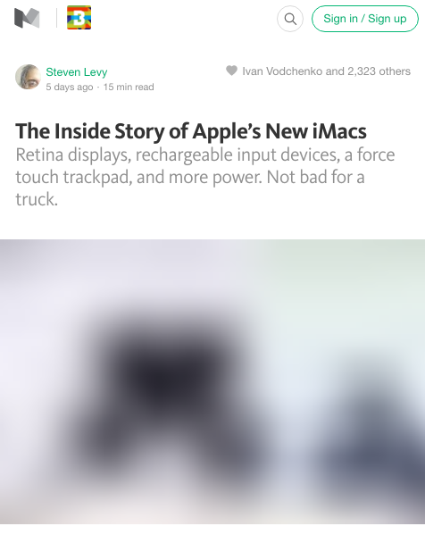
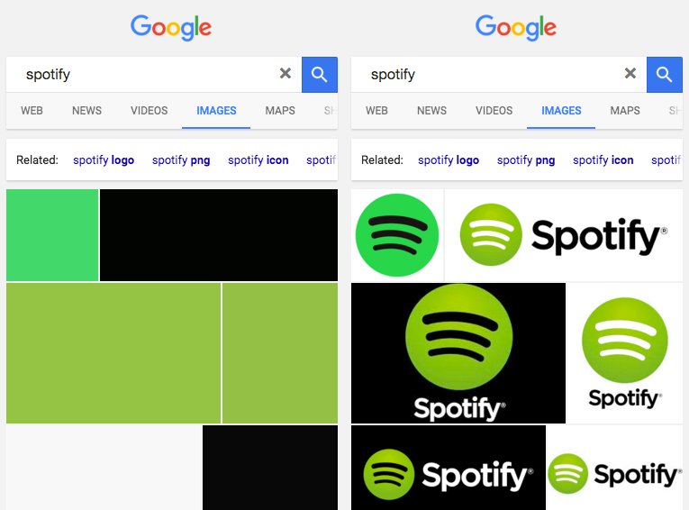

[原文地址](https://jmperezperez.com/medium-image-progressive-loading-placeholder/)
**翻译地址**：https://github.com/lx7575000/Translation

译者注：感谢xiaoxin38250(微信)帅哥的卖力校对，否则这篇文章读起来会更烂。

我在[Medium]()浏览帖子的时候发现他们的图片加载效果真的很赞诶。首先载入一个低像素的模糊图片，然后逐渐转变为高清大图。这个过程体验真的很好，所以我希望能够明白他们是使用什么方法做到的。



##Medium的技术
我使用[WebPageTest]()测试这个[页面](https://medium.com/backchannel/exclusive-why-apple-is-still-sweating-the-details-on-imac-531a95e50c91)的载入过程。如果你希望能够测试同样效果，可以打开Medium的页面，禁用cache减慢图片申请加载的过程，所以加载出原图的时间会稍久。这样就可以清楚看到整个图片的加载效果。

**具体执行过程**

1. 使用`div`限定好图片展示的区域，Medium使用`<div>`标签并加入`padding-bottom`样式设定对应图片的展示尺寸。通过这样占位的方式可以防止在图片加载后出现整体页面**回流**的情况。这种方法通常被称为[intrinsic placeholders](http://daverupert.com/2015/12/intrinsic-placeholders-with-picture/)

2. **加载小尺寸(像素低)的图片**，此时网页会先请求一个像素质量较低的小号缩略图（大小为原图的20%）.这个小图片使用``标签,因此浏览器会在标签加载完成后，立即请求图片资源。

3. 只要图片加载完成，它就会被“画”到`<canvas />`中。图片数据会被`main-base.bundle.js`文件中自定义的`Blur()`函数重新计算，可以看到它会产生模糊图片的效果。尽管有些不同，不过该函数与[StackBlur]()的模糊函数实现效果是相似的。**在模糊图片生成的同时，浏览器也会开始请求高清原图资源。**

4. 最后原图被加载到页面上，`canvas`会被隐藏，只展示原图。

最后的最后，感谢CSS的动画功能，上述所有转变过程会很流畅。

##Markup
**整个展示图片的结构**
```HTML
<figure>
  <div>
    <div/> <!-- 这个div用于做图片加载过程中的占位符 -->
     <!-- 低像素的缩略图 -->
    <canvas/> <!-- 给上面的缩略图加上模糊效果 -->
     <!-- 展示的高清无码原图 -->
    <noscript/> <!-- fallback for no JS -->
  </div>
</figure>
```

```HTML
<figure name="7012" id="7012" class="graf--figure graf--layoutFillWidth graf-after--h4">
  <div class="aspectRatioPlaceholder is-locked">
    <div class="aspect-ratio-fill" style="padding-bottom: 66.7%;"></div>
    <div class="progressiveMedia js-progressiveMedia graf-image is-canvasLoaded is-imageLoaded" data-image-id="1*sg-uLNm73whmdOgKlrQdZA.jpeg" data-width="2000" data-height="1333" data-scroll="native">
      
        <canvas class="progressiveMedia-canvas js-progressiveMedia-canvas" width="75" height="47"></canvas>
        
        <noscript class="js-progressiveMedia-inner">&lt;img class="progressiveMedia-noscript js-progressiveMedia-inner" src="https://cdn-images-1.medium.com/max/1800/1*sg-uLNm73whmdOgKlrQdZA.jpeg"&gt;</noscript>
    </div>
  </div>
</figure>
```
**PS：实际图片大小要根据设备尺寸来设定。**

##尝试重新实现同样效果
我在[CodePen](http://codepen.io/jmperez/pen/yYjPER)重新通过使用`CSS`替代`canvas`实现同样的加载效果。下面的图片展示了整个加载过程中，图片的转变效果。


##这么做是否值？
很明显,现在有许多种方法来实现同样的效果。要知道在几年前如此高性能的方式实现动画和模糊效果还是不可能的。但事实上,大多数时候延迟瓶颈,并不是设备本身的原因,因此这些技巧值得我们探索。
**控制加载图片过程有以下优点：**
* 懒加载：使用JS来请求资源让我们可以灵活控制图片资源选择。小图可以请求同一缩略图，大图则可以根据浏览器视窗大小来选择加载尺寸不同的图片。
* 更好的占位符： 相比于纯色占位符，使用缩略图添加模糊效果后会有更好的视觉效果，同时图片大小也只有2k左右不会牺牲负载。
* 裁剪图片大小：Medium根据访问设备的不同，返回不同尺寸的图片，这样可以很好的优化页面的加载速度，同时避免移动设备浪费过多流量。

##其他版本
在实现Medium原方法之前，我觉得我可以在我的网站使用其他方法来实现。
###内联图片数据
我们可以在`img`中添加缩略图的**URLs**来直接请求资源。这样做虽然会增加HTML的内容，但是可以加快占位符的生成速度。浏览器加载好HTML标签就立即下载图片文件资源。加了模糊效果后图片的质量就无所谓了，我测试使用0.5k大小的图片与2k大小的图片得到相似的显示效果。
###模糊效果
默认情况下,当浏览器将一个小图像放大,它应用光滑效果处理图像的模糊效果。图像的效果也可以关闭，像QR码。
>[…]the browser would render it in a way that didn’t make it look blocky[…] from [Google Developers](https://developers.google.com/web/updates/2015/01/pixelated).

它可以在Chrome、Safari和Firefox中有效，尽管光滑效果在Chrome中更有效，你可以在[这里](http://codepen.io/jmperez/full/Xmzobe/)看效果。

下面我们看看如何做到光滑效果。图片只有27px宽，并且像素非常低，将它放大会产生很可怕的效果。事实却并没有。如果上述效果能满足你的要求，那你就不需要更复杂的效果替换了。

上述图片模糊效果也可以使用[CSS Filter Effects](http://codepen.io/aniketpant/pen/DsEve)实现，它还支持IE浏览器哦(IE一生黑)。我相信Medium在使用`canvas`方法之前一定也尝试过使用这个功能更强的方法。但是可能是出于一定原因他们放弃了这一方法。**这一方法的优点是你可以设定模糊度，并且可以通过CSS达成其他目的。**

也可以使用**SVG**的filter来达成同样目的，如[The “Blur Up” Technique for Loading Background Images](https://css-tricks.com/the-blur-up-technique-for-loading-background-images/) 和 [Textured Gradients in Pure CSS](http://rentafounder.com/textured-gradients-in-pure-css/)两篇文章提到的。

##其他办法提升占位符：Google 图片搜索
当你在手机上搜索图片时，Google使用了一种简单的方法来实现图片占位。


他们选择图片的一种主颜色，并用其作为占位块的背景色。这样做会给用户一种图片加载速度更快的体验。

##更先进的方法：Facebook的200 byte技术
年初Facebook发表过一篇["The technology behind preview photos"](https://code.facebook.com/posts/991252547593574/the-technology-behind-preview-photos/)的文章，这篇文章主要说明如何预览一个没有JPEG头的`42 * 42px`的图片。
使用场景有些不同，这“图片”被用于Facebook的手机端，它知道如何组成一个有效的JPEG图片。此处我们在Web端使用的话需要编写JavaScript代码，这样做同样会增加存储资源。当然我们可以通过在服务器端组成这个图片解决这一问题，但是这样仍需要一些JavaScript代码发送申请图片资源的请求。

无论如何，这个方法对于Web端来说有点大材小用，但我还是希望能够将其作为一个参考。[Using WebP for generating this preview images](https://jmperezperez.com/webp-placeholder-images/)同样可以节省内存，并且不需要使用如此**创造性**的解决方法。

##LQIP: Low Quality Image Placeholders
与其等待最终的图像呈现,我们可以先提供一个高度压缩的图片,然后切换到大图。这就是[LQIP](http://www.guypo.com/introducing-lqip-low-quality-image-placeholders/)方法的思路。这一方法与Medium相似，不过是使用相同尺寸，但压缩更高的图片。

##总结
随着页面加载的图片越来越多，需要勤于思考页面的加载过程。因为这会影响加载效率和用户体验。
如果你生成几个缩略图大小的图片，你可以实验使用一个非常小的图片作为背景，等待最终图片被加载出来。

**其他图片加载技巧：**[ Image optimization: Lossy, lossless and other techniques.
](https://jmperezperez.com/image-optimization-lossy-lossless-techniques)

（译者）写在最后：作为英语四级勉强过线选手，如果翻译有不到位地方，请多包涵。如若不能包涵就请跟着链接跳转看原文。当然，如果你感觉文章内容不错，就我给个star吧。

