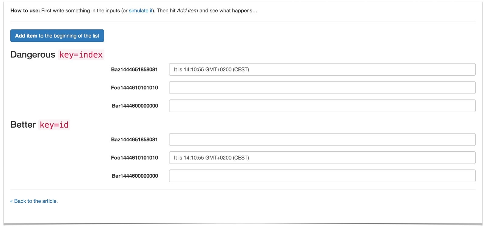

# （译）应用Index 作为 key属性值是反模式

[原文地址](https://medium.com/@robinpokorny/index-as-a-key-is-an-anti-pattern-e0349aece318#.jadd313vz)

经常可以看到开发者们在编写`React`代码render一个列表时使用对象元素的*index* 来作为其**key**属性值。

```js
{todos.map((todo, index) =>
  <Todo {...todo}
    key={index} />
)}
```

这样看起来很优雅，并且解决了React的警告问题。然而，真正危险之处就在此：
**它可能会导致你的应用展示的数据与预期不符。**

在此我要解释一下，**key**属性在`React`当中的作用就是确定DOM元素。当你在列表中添加或删除一个元素时会发生什么？如果**key**属性和之前的`React`假设的DOM元素的组件**key**值表示相同时。它就不一定正确了。
我写了一个简单的[例子](http://output.jsbin.com/wohima)，来说明这么做的危险。



根据例子我们看到，`React`会在我们没有给**key**属性赋值的时候使用**index**来进行赋值。然而，它同时也会提醒你这么做不是最优选择。如果你在你自己的`React`项目中应用了这最简单方法，记住上面例子，会导致不可预计的结果。

##Better

列表中的每个元素都应该赋一个独一无二且持久保持的**key**值。最理想的赋值方式是是当元素被创建时就进行**key**赋值。我们可以使用以下方式。

```js
{todos.map((todo) =>
  <Todo {...todo}
    key={todo.id} />
)}
```

我们通过递增的形式给每个元素赋值，声明一个全局index变量，并确保任意两个元素持有不用的**ID**属性

```js
todoCounter = 1;
function createNewTodo(text) {
  return {
    completed: false,
    id: todoCounter++,
    text
  }
}
```

##Much Better
我们可以使用一种更加健壮的方式来进行元素的**id**赋值，比如我们可以使用[shortid](https://www.npmjs.com/package/shortid)。它能快速产生“长度短、无序、url独一无二且友好的”**id**值。

```js
var shortid = require('shortid');
function createNewTodo(text) {
  return {
    completed: false,
    id: shortid.generate(),
    text
  }
}
```