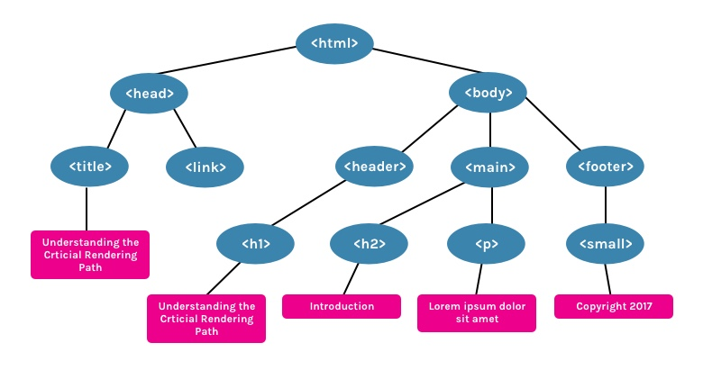
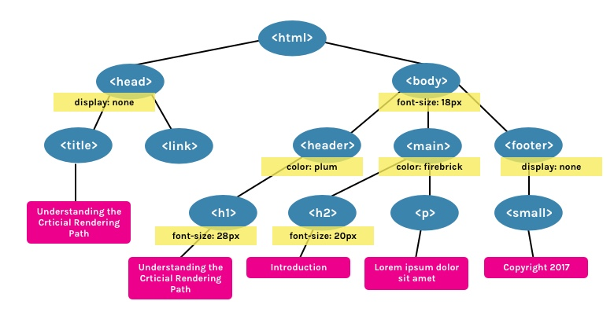
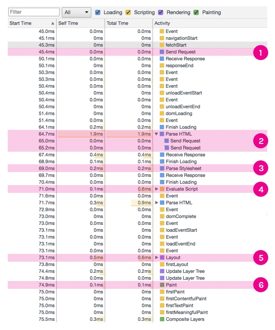

#(译）理解浏览器渲染的关键步骤
**在in面试被CTO问到的问题，谨以此翻译来表达对自己知识匮乏的鄙视👎。**

当浏览器接收到从服务器发送过来的HTML页面信息，在将其绘画渲染到屏幕上之前会有许多的步骤要做。浏览器绘制页面需要做的这一系列行为我们称为**渲染关键步骤。**

了解**CRP**的知识对于你理解如何提升网站渲染效率非常有用，**CRP**总共有六步：

1.  构建DOM树
2.  构建CSSOM树
3.  运行`JavaScript`
4.  创建渲染树
5.  生成布局
6.  绘制页面


#1. 构造DOM树
DOM（Document Object Model）树是一个表示全解析过的HTML页面的对象。从根节点元素`<html>`开始，会逐个创建页面中的每个元素/文本节点。元素包裹的其他元素会被作为子元素节点，并且每个节点会包含其全部的属性。例如：`<a>`标签会有`href`属性与其节点关联。
举个🌰：
```HTML
<html>  
<head>  
  <title>Understanding the Critical Rendering Path</title>
  <link rel="stylesheet" href="style.css">
</head>  
<body>  
  <header>
      <h1>Understanding the Critical Rendering Path</h1>
  </header>
  <main>
      <h2>Introduction</h2>
      <p>Lorem ipsum dolor sit amet</p>
  </main>
  <footer>
      <small>Copyright 2017</small>
  </footer>
</body>  
</html>
```
上述HTML会被解析成如下的DOM树


HTML很好的特点在于不需要全部加载完成页面所有内容才来显示网页，可以解析完成一部分内容呈现一部分。但是，其他资源比如CSS和JavaScript会阻止页面的渲染。

#2. 构建CSSOM树
CSSOM（CSS Object Model）是一个表示各个DOM相关样式的对象，它的表示方法与DOM相似，但是各个节点存在相关的样式值。不论其是显示、还是隐式声明这些样式。
在`style.css`文件中，我们有如下样式：
```CSS
body { font-size: 18px; }

header { color: plum; }  
h1 { font-size: 28px; }

main { color: firebrick; }  
h2 { font-size: 20px; }

footer { display: none; } 
```
接着会创建如下的CSSOM树：


CSS一直被认为是一种**渲染阻塞资源**。因此如果在首次加载时没有全部解析资源内容就无法进行渲染树的构建。与HTML不同，CSS具有层叠继承的特性，因此不能进行局部加载。定义在文档后面的样式属性会覆盖或更改写之前定义的同类属性。即，如果如果CSS可以进行局部加载的话会导致出现加载错样式的情况。因此表明，CSS必须全部解析之后才能进行下一步。

如果CSS文件适用于当前设备的话，仅仅只是会阻塞渲染。`<link rel="stylesheet">`标签可以接受`media`属性来指定特定样式宽度的特定媒体查询。🌰：如果我们有一个样式表具有`orientation:landscape`的媒体属性，并且我们查看该页面使用`portrait`模式，就不会出现资源加载而产生的渲染阻塞情况。

CSS要会导致脚本阻塞，这是由于JavaScript文件必须等待CSSOM构建结束之后才进行加载。

#运行JavaScript
JavaScript被认为是**解析阻塞资源**，这表示当解析HTML文档自身时候会被JavaScript给阻塞掉。

当解析器解析到`<script>`标签时，无论该资源是内部还是外链的都会停止解析，并且等到资源被下载并运行结束后才继续进行解析。这也是为什么如果我们有一个引用了JavaScript文件的元素，它必须被放在可视文档元素之外的原因。

为避免JavaScript解析阻塞，它可以通过设定`async`属性来要求其异步加载。
```HTML
<script async src="script.js">  
```

#4 创建渲染树(Render Tree)
渲染树是DOM树和CSSOM树的结合体，它代表最终会渲染在页面上的元素的结构对象。它表示只会关注可见内容，对于被隐藏或者CSS属性`display:none`的属性，不会被包含在结构内。

使用上面例子的DOM和CSSOM，渲染树被创建如下：


#5. 生成布局
布局决定了浏览器视窗大小，它提供了上下文依赖的CSS样式，如百分比或窗口的单位。视窗尺寸通常通过`<head>`标签中的`<meta>`中的`viewport`设定来决定。如果不存在该标签，则通常默认为**`980px`**。

例如：最常用的`meta viewport`值是设定视窗大小与设备宽度对应：

```HTML
<meta name="viewport" content="width=device-width,initial-scale=1">  
```
举个🌰，如果用户使用设备访问网页，宽度为1000px。然后整体视窗尺寸就会基于这个宽度值了，比如`50%`就是500px,`10vw`就是100px。

#6. 绘制页面
最后，在绘制页面步骤。页面上的所有可见内容都会被转换为像素并呈现在屏幕上。

具体的绘制时间跟DOM数以及应用的样式有关。有些样式会话费更多的执行时间，比如复杂的渐变背景图片所需要的计算时间远超过简单固定背景色。

#整合所有
想要看到渲染关键步骤的执行流程，可以使用Chrome的**DevTools**：
```HTML
<html>  
<head>  
  <title>Understanding the Critical Rendering Path</title>
  <link rel="stylesheet" href="style.css">
</head>  
<body>  
  <header>
      <h1>Understanding the Critical Rendering Path</h1>
  </header>
  <main>
      <h2>Introduction</h2>
      <p>Lorem ipsum dolor sit amet</p>
  </main>
  <footer>
      <small>Copyright 2017</small>
  </footer>
  <script src="main.js"></script>
</body>  
</html>  
```
可以看关于页面加载时的事件日志，以下是我们获得的：


1. 发送请求：发送`GET`请求index.html
2. 解析HTML然后发送请求：开始解析HTML并构建DOM，然后发送`GET`请求style.css和main.js。
3. 解析样式表：根据style.css生成CSSOM
4. 执行计算脚本：执行main.js
5. 布局：基于HTML的元视窗标签，生成布局
6. 绘制页面：绘制网页

[原文链接：Understanding the Critical Rendering Path](https://bitsofco.de/understanding-the-critical-rendering-path/)

